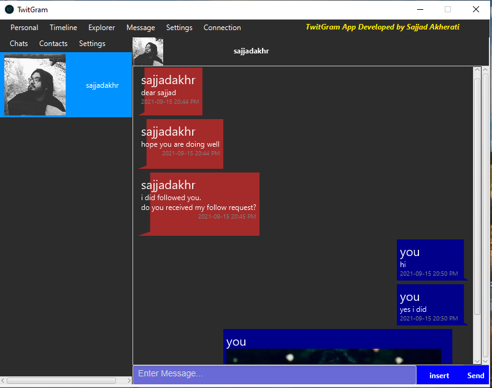

# Twitgram-Application
This project was the final project of advanced programming course. We wanted to develope the graphical interface for a social media application like twitter. 
Here, you can see some screenshots from the developped project:
# Screenshots

   
  
  
  
   
  
  
  
   
  
  
  
  
  
  
  

